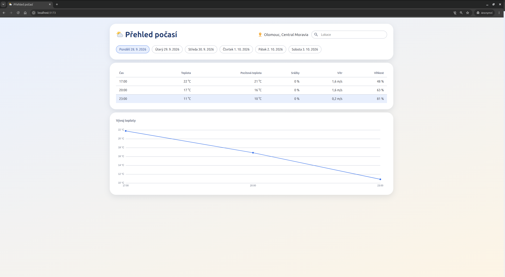
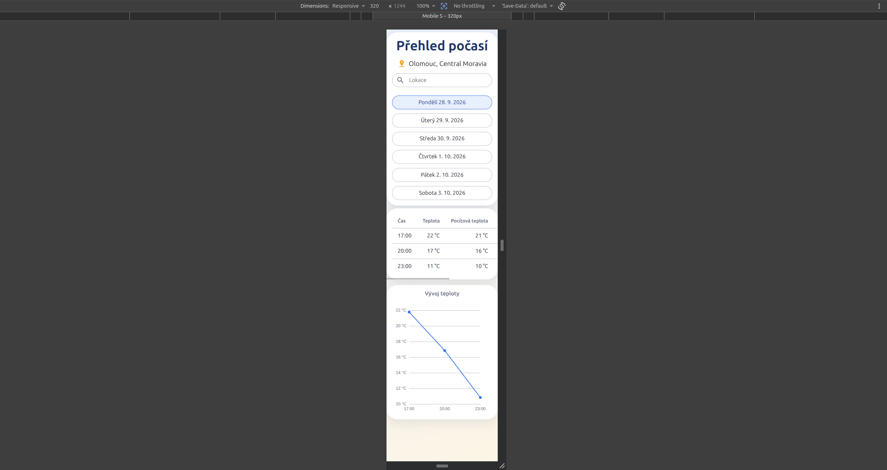
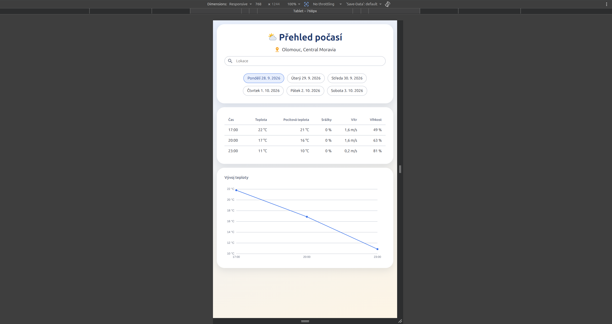
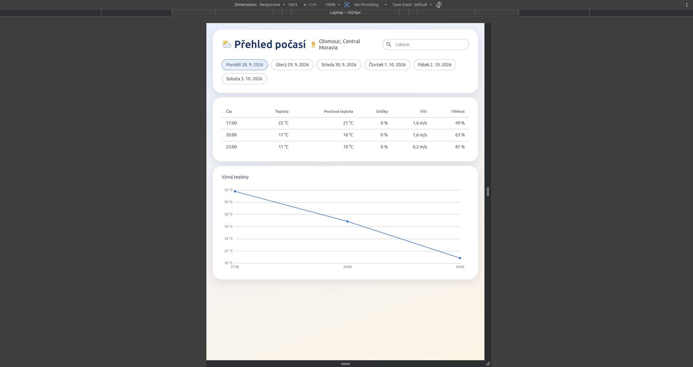
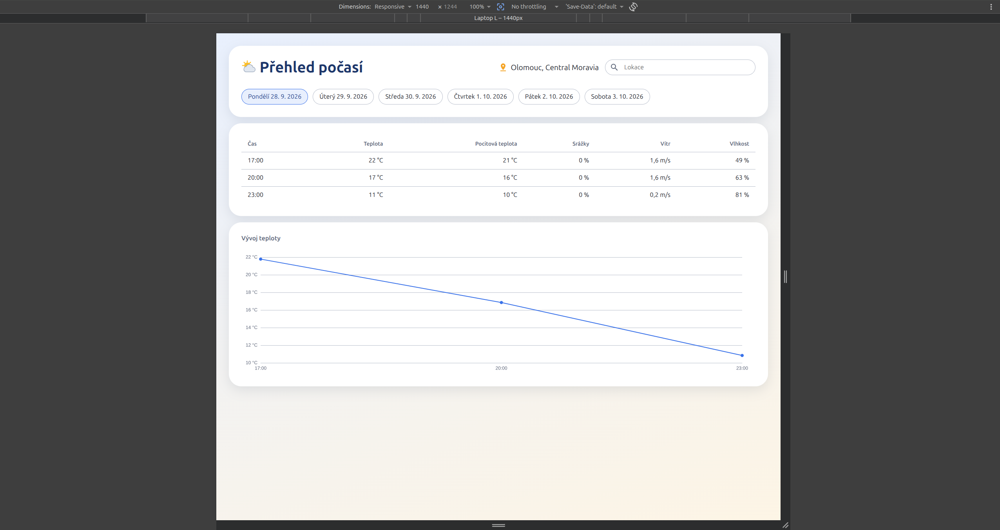
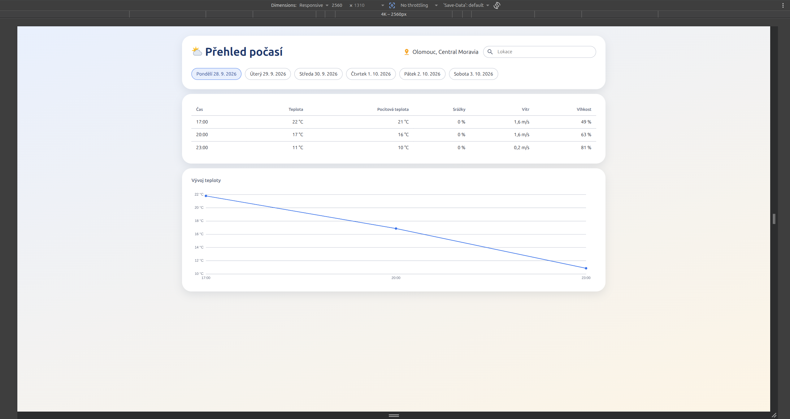

# Přehled počasí (weather-app)

Aplikace zobrazuje pětidenní přehled počasí pro konktrétní místo, které si uživatel vybere prostřednicvím vyhledávacího
pole a následného výběru z dostupných možností.

Uživatel nejdříve vybere lokalitu, nasledně se načnou potřebaná data a zobrazí se výběr pěti dnů, defaultně je zvolen
první den. Následně uživatel může přepínat jednotlivé dny a na základě výběru dne se zobrazuje přehled počasí v daném
dnu a to ve tříhodinnových intervalech.



## Spuštění

Požadavky: [Node.js](https://nodejs.org/) (aktuální LTS) a bezplatný API klíč
z [OpenWeather](https://home.openweathermap.org/api_keys).

```bash
npm install
cp .env.example .env    # do .env doplnit VITE_OPENWEATHER_API_KEY
npm run dev             # vývojový server
```

| Příkaz            | Popis                                                |
|-------------------|------------------------------------------------------|
| `npm run dev`     | spustí vývojový server (Vite)                        |
| `npm run build`   | typová kontrola (`tsc`) a produkční build do `dist/` |
| `npm run preview` | lokálně spustí produkční build                       |

**Bez API klíče aplikace zobrazí upozornění a nenačte se.**

## Podporované prohlížeče

Poslední verze prohlížečů Google Chrome, Mozilla Firefox, Microsoft Edge a Safari.

Zjištění aktuální polohy vyžaduje zabezpečené spojení (HTTPS, případně `localhost`) a souhlas uživatele.

## Struktura

- tech stack: `TypeScript`, `HTML`, `Sass`, build pomocí `Vite`
- napojení na externí `API` [OpenWeather](https://openweathermap.org/)
- graf: [ECharts](https://echarts.apache.org/) (knihovnu pro graf zadání povoluje), jinak bez knihoven třetích stran
- objektový přístup v celé codebase (třídy, pomocné třídy se statickými metodami)

```
public/data/cities.min.json   seznam měst pro našeptávač (OpenWeather city list, minifikovaný)
src/
  main.ts                     vstupní bod – vytvoří a inicializuje App
  controllers/                správa jednotlivých částí DOM
  api/                        komunikace s API a zdroji dat
  types/                      doménové typy aplikace
  types/dto/                  typy odpovídající datům z API (DTO)
  utils/                      pomocné funkce (datum, formátování, geolokace, rušení requestů)
  assets/css/                 styly (Sass, BEM)
```

### Controllers

Každý controller spravuje svou část DOM a o ostatních neví. Komunikace probíhá přes `App`:
data putují dolů přes metody controllerů, události nahoru přes callbacky předané v konstruktoru.

- `App` – drží stav aplikace (vybraná lokalita, předpověď), propojuje controllery, řídí orchestraci
- `Searchbar` – vyhledávací pole s našeptávačem
- `HeaderControls` – zobrazení vybrané lokality
- `DayTabs` – výběr dne
- `Forecast` – načtení předpovědi, zprávy (načítání, chyba), předává data vybraného dne `ForecastTable` a `ForecastGraph`
- `ForecastTable` – tabulka předpovědi vybraného dne ve tříhodinových intervalech
- `ForecastGraph` – graf vývoje teploty vybraného dne

```
Searchbar ──onLocationSelected(city)──► App ──► HeaderControls (název lokality)
                                         └────► Forecast.loadData(city)
Forecast  ──onDataLoaded(days)────────► App ──► DayTabs (dny), Forecast.draw(první den)
DayTabs   ──onDaySelected(day)────────► App ──► Forecast.draw(day)
                                                  ├──► ForecastTable.draw(dayForecast)
                                                  └──► ForecastGraph.draw(dayForecast)
```

### API a data

- `WeatherApi` – volání OpenWeather API (předpověď, reverse geocoding, vyhledávání měst)
- `CityRepositoryApi` – načte lokální seznam měst jednou a vyhledává v něm v paměti
- `WeatherMapper` – převod DTO z API na doménové typy, seskupení předpovědi po dnech

| Účel                  | Zdroj                                   |
|-----------------------|-----------------------------------------|
| našeptávač měst       | `public/data/cities.min.json`           |
| název aktuální polohy | OpenWeather Reverse Geocoding API       |
| předpověď             | OpenWeather 5 day / 3 hour Forecast API |

Našeptávač lze přepnout na OpenWeather Geocoding API vypnutím flagu `enableCityRepository` v `Searchbar`. Lokální seznam
měst obsahuje u některých měst anglické názvy (např. `Prague`).

Při spuštění se aplikace pokusí zjistit aktuální polohu uživatele. Pokud to není možné (zamítnutí, nepodporovaný
prohlížeč, chyba), použije se výchozí lokalita Olomouc.

Data a časy jsou formátovány podle jazyka prohlížeče (`Intl`).

### Graf

`ForecastGraph` zobrazuje vývoj teploty vybraného dne – na ose x čas, na ose y teplota, tooltip s teplotou a pocitovou
teplotou.

- nastavení grafu sestavuje statická metoda `ForecastGraph.createOption`
- z ECharts se registrují jen použité části (`LineChart`, `GridComponent`, `TooltipComponent`, `CanvasRenderer`)
- barvy se čtou z CSS proměnných (`Utils.readCssVar`), ECharts kreslí do canvasu a proměnné neumí použít přímo
- graf se inicializuje ve skryté sekci, proto se po zobrazení a při změně velikosti okna přepočítá jeho velikost

### Styly

- metodika [BEM](https://getbem.com/), jeden soubor na blok
- moduly Sass (`@use`)
- `abstracts/` – proměnné (barvy, písmo, okraje, zaoblení) a breakpointy
- `base/` – reset a globální styly
- `layout/` – rozložení stránky (`app`, `container`)
- `components/` – jednotlivé bloky (`header`, `searchbar`, `day-tabs`, `forecast-table`, `forecast-chart`, …)
- `utils/` – utility třídy (`flex`, `gap-*`, `hidden`, …)

## Responsivita

Styly jsou psané *mobile first* – výchozí styly platí pro mobil, větší obrazovky se doplňují přes mixin `bp.up()`.

| Breakpoint | Šířka           |
|------------|-----------------|
| `sm`       | 36rem (576 px)  |
| `md`       | 48rem (768 px)  |
| `lg`       | 64rem (1024 px) |
| `xl`       | 80rem (1280 px) |

Breakpointy jsou v `rem`, takže se layout přizpůsobí i zvětšenému písmu v nastavení prohlížeče.

- **mobil** – hlavička pod sebou, dny pod sebou přes celou šířku, tabulku lze posouvat do stran
- **od `md`** – dny vedle sebe, větší odsazení
- **od `lg`** – nadpis, lokalita a vyhledávání v jednom řádku, vyhledávání s omezenou šířkou

```scss
@use "../abstracts/breakpoints" as bp;

.header {
  flex-direction: column;

  @include bp.up(lg) {
    flex-direction: row;
  }
}
```

### Náhledy

#### Mobil



#### Tablet



#### Laptop



#### Laptop L



#### 4K



## Implementace

| Větev   | Implementace              |
|---------|---------------------------|
| `main`  | TypeScript bez frameworku |
| `vue`   | Vue 3                     |
| `react` | React 19                  |

Funkčnost a vzhled jsou ve všech implementacích stejné, liší se vnitřní struktura. Každá větev obsahuje README
odpovídající své implementaci.
